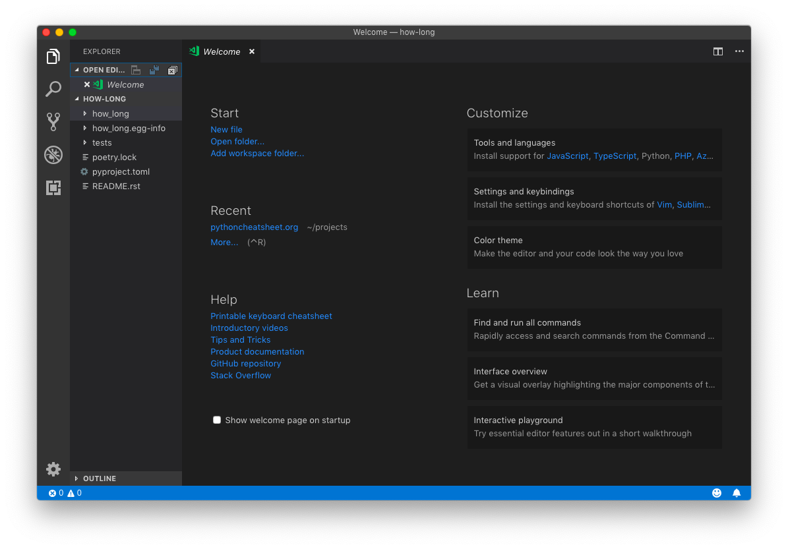

In the [fist part](https://www.pythoncheatsheet.org/blog/python-projects-with-poetry-and-vscode-part-1), we learned what is the `pyproject.toml` file and how to use it, used [Poetry](https://poetry.eustace.io/) to start a new project, create a Virtual Environment and add and remove dependencies. We did all of this with the following commands:

| Command                           | Description                                            |
| --------------------------------- | ------------------------------------------------------ |
| `poetry new [package-name]`       | Start a new Python Project.                            |
| `poetry init`                     | Create a *pyproject.toml* file interactively.          |
| `poetry install`                  | Install the packages inside the *pyproject.toml* file. |
| `poetry add [package-name]`       | Add a package to a Virtual Environment.                |
| `poetry add -D [package-name]`    | Add a dev package to a Virtual Environment.            |
| `poetry remove [package-name]`    | Remove a package from a Virtual Environment.           |
| `poetry remove -D [package-name]` | Remove a dev package from a Virtual Environment.       |

And in this second and last part we'll:

- Add our virtual Environment to [VSCode](https://code.visualstudio.com/).
- Integrate *Pytest*, *Black* and *Flake8* with the editor (dev dependencies installed in the fist part).
- Write a sample library.
- Build our project with *Poetry*.
- Publish our project on *PyPI*.

Before we start, make sure you have installed [VSCode](https://code.visualstudio.com/), added the [Python](https://marketplace.visualstudio.com/itemdetails?itemName=ms-python.python) extension and that you have followed and/or understood the first part of this article.

## Setting Up Poetry on VSCode

A few days have passed since the first part, so it may be a good idea to check for new versions of the dependencies we installed. Open your terminal and navigate inside your project folder and type the `poetry update` command:


Ok, to this day there are no new versions available.

When you create a Virtual Environment with the *venv* command, VSCode will automatically add it as the default Python Environment for that project. When working With *Poetry*, the first time we will need to open the terminal and inside our project folder:

```
$ poetry shell
$ code .
```

The first command, `poetry shell`, will spawn us inside our virtual environment, and `code .` will open the current folder inside VSCode.



Navigate to the *how-long* (or the folder with your project name) using the left panel and along side to the `__init__.py`, create a `how-long.py` file. In the bottom left corner you'll see the current Python Environment:


Click it and a list of available Python installation will display. Choose the one that has the name of your project in it:


Now, let's integrate our dev dependencies, *Flake8*, *Black*, and *Pytest* to Visual Studio Code.

### Flake8

*Flake8* will provide our projects with *linting* capabilities. In other words, syntax and style errors, and thanks to VSCode, we will know them as we type.

By default, the Python extension comes with *Pylint* enabled, which is powerful but complex to configure.

If you make a change to any Python file and save it, in the bottom right corner a popup message will display:


Click on select linter and choose *flake8* from the list. Now, VSCode will tell us our syntax style problems, in green or red depending the severity of the error, both with a nice description of what is wrong:


Seems like we have two problems: we are missing a blank line at the end of our file (style) and we forgot to write our *Hello, World* inside quotes. Fix these errors and all the warnings will disappear.

### Black

*Black* is a code formatter, a tool that will look at our code and automatically format it in compliance to the [PEP 8](https://www.python.org/dev/peps/pep-0008/) style guide, the same *PEP* that use *Flake8* to lint our style errors.

Hold `shift + cmd + p` on Mac, or `shift + ctrl + p` on Windows or Linux to open the Command Palette and type *format document* and enter. A new popup message will appear:


Select *Use Black*. Now copy this poorly formated code into your python file:

```python
for i in range(5):         # this comment has too many spaces
      print(i)  # this line has 6 space indentation.
```

What an ugly and full of errors piece of s***... code. Try formating it again and see how black fix all of them for you!

Another thing we can do is to configure VSCode so that every time we save, *Black* will automatically format our code. Hold `cmd + ,` on Mac or `ctrl + ,` on Windows and Linux to open the Settings. Make sure you are in the *Workspace Settings*, search for *format on save* and activate the checkbox:


Lastly, *Black* defaults to 88 characters per line in contrast with the 80 allowed by *Flake8*, so to avoid conflicts, open `.vscode` folder and add the following at the end of the file:

```
{
    ...
    "python.linting.flake8Args": [
        "--max-line-length=88"
    ],
}
```


### Pytest

Lorem ipsum dolor sit amet consectetur adipisicing elit. Laboriosam nostrum maxime hic quaerat rerum aspernatur similique voluptatum illum veritatis sint sequi fugiat odio, numquam saepe quisquam accusantium assumenda corporis soluta.

## Conclusion

Lorem ipsum dolor sit amet consectetur adipisicing elit. Laboriosam nostrum maxime hic quaerat rerum aspernatur similique voluptatum illum veritatis sint sequi fugiat odio, numquam saepe quisquam accusantium assumenda corporis soluta.