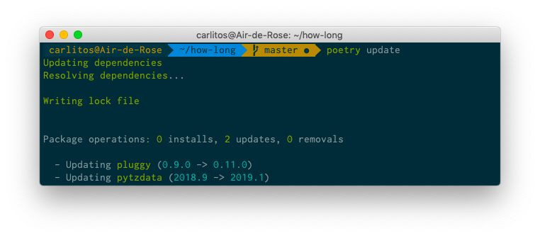
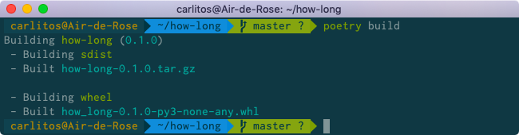
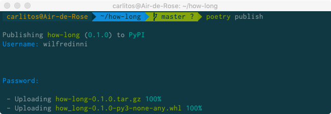
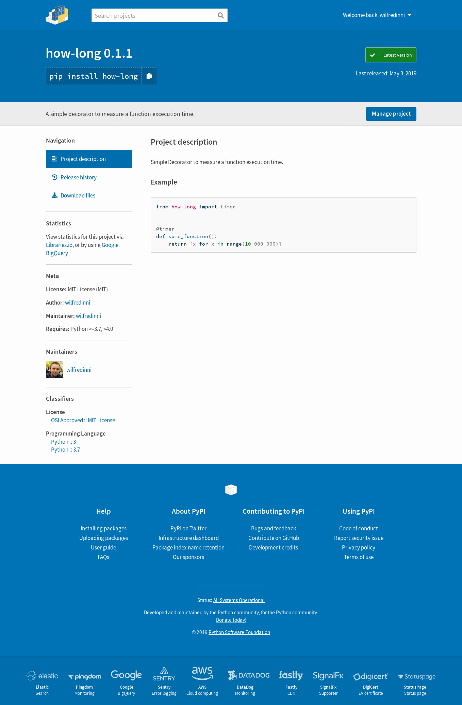

We're almost there! so far we have:

- [Started a new project](https://www.pythoncheatsheet.org/blog/python-projects-with-poetry-and-vscode-part-1#Starting-a-New-Project).
- [Created a Virtual Environment](https://www.pythoncheatsheet.org/blog/python-projects-with-poetry-and-vscode-part-1#Creating-a-Virtual-Environment) with *Poetry*.
- [Added, Deleted and Updated](https://www.pythoncheatsheet.org/blog/python-projects-with-poetry-and-vscode-part-1#Dependency-Management) dependencies.
- Added our [Virtual Environment to VSCode](#Setting-Up-Poetry-on-VSCode).
- [Configured *Flake8*](#Flake8) to *lint* our code as we type.
- Choose [*Black*](#Black) as the formatter.
- And [included *Pytest*](#Pytest) to run our tests in a visual way.

And finally, we will write, build and publish our project to [Pypi](https://pypi.org)!

## The Project

As mentioned earlier, we will write a very simple decorator that the only thing it does is print to the console how long it takes for a function to run. It will work like this:

```python
from how_long import timer

@timer
def test_function():
    [i for i in range(10000)]

test_function()
# Execution Time: 955 ms.
```

And at the end, your project directory will look, more or less, like this:

```
how-long
├── how_long
│   ├── how_long.py
│   └── __init__.py
├── how_long.egg-info
│   ├── dependency_links.txt
│   ├── PKG-INFO
│   ├── requires.txt
│   ├── SOURCES.txt
│   └── top_level.txt
├── LICENSE
├── poetry.lock
├── pyproject.toml
├── README.rst
└── tests
    ├── __init__.py
    └── test_how_long.py

```

Before we start, lets check for package updates with the `poetry update` command:



First, add short description of the project in the `README.rst`:

```rst
how_long
========

Simple Decorator to measure a function execution time.

Example
_______

.. code-block:: python

    from how_long import timer


    @timer
    def some_function():
        return [x for x in range(10_000_000)]
```

Now, navigate to `how_long/how_long.py` and add the following:

```python
# how_long.py
from functools import wraps

import pendulum


def timer(function):
    """
    Simple Decorator to measure a function execution time.
    """

    @wraps(function)
    def function_wrapper():
        start = pendulum.now()
        function()
        ellapsed_time = pendulum.now() - start
        print(f"Execution Time: {ellapsed_time.microseconds} ms.")

    return function_wrapper
```

In the `how_long/__init__.py` file:

```python
from .how_long import timer

__version__ = "0.1.1"
```

And finally, in `tests/test_how_long.py`:

```python
from how_long import __version__
from how_long import timer


def test_version():
    assert __version__ == "0.1.1"


def test_wrap():
    @timer
    def wrapped_function():
        return

    assert wrapped_function.__name__ == "wrapped_function"
```

You can now type `poetry install` on your terminal to install and prove your package locally. Activate your virtual environment if you haven't and enter the
Python interactive shell:

```python
>>> from how_long import timer
>>>
>>> @timer
... def test_function():
...     [i for i in range(10000)]
...
>>> test_function()
Execution Time: 705 ms.

```

Now run the tests and if everything is fine, lets move on.

## Building and Publishing

Finally, the time to make our package available to the world has come! First make sure you have an account on [Pypi](https://pypi.or). If don't have one, you will need to [register](https://pypi.org/account/register/) one. Remember that you need to choose an unused name for your project, if unsure go and use the [search](https://pypi.org/search/?q=) to check it out.

### Build

The `poetry build` command builds the source and wheels archives that will letter be uploaded as the source of your project:



The *how_long.egg-info* directory will be created.

## Publish

This command publishes the package to *Pypi* and automatically register it before uploading if this is the first time it is submitted:



Enter your credentials and if everything is ok, [browse your project](https://pypi.org/project/how-long/) and you'll see something like this:



Congratulations!! you can now `poetry add how-long` or `pip install how-long` or `pipenv install how-long`.

## Conclusion
