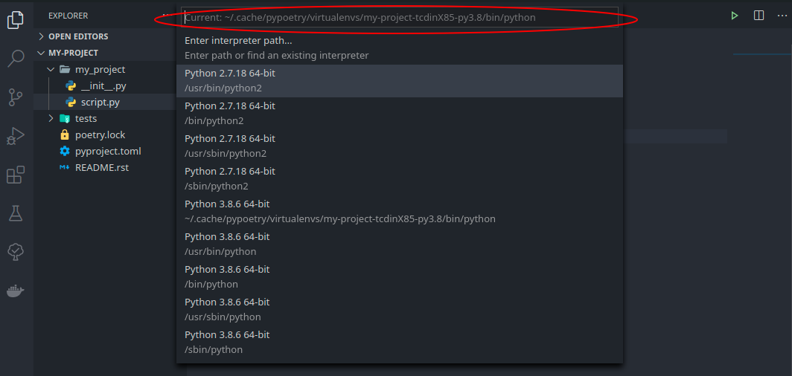
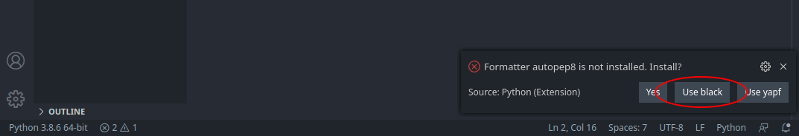

# Debugging Python projects with Poetry and VSCode

This is kind of a fourth part of the `Python projects with Poetry and VSCode` series, but instead of using the [previous project](https://github.com/wilfredinni/how-long), we will create everything from scratch.

## Creating a new project

Lets start by creating a new project.

```shell
$ poetry new my-project
Created package my_project in my-project
$ cd my-project
$ poetry shell
Creating virtualenv my-project-tcdinX85-py3.8 in /home/user/.cache/pypoetry/virtualenvs
Spawning shell within /home/user/.cache/pypoetry/virtualenvs/my-project-tcdinX85-py3.8
```

`poetry new` will bootstrap a basic project structure for us, and `poetry shell` will activate the virtual environment (and if it doesn't exist, it will also create it).

## Adding dependencies

Nothing fancy, just `flake8` as our style enforcement tool and `black` to format the code.

```shell
$ poetry add -D black flake8
Using version ^20.8b1 for black
Using version ^3.8.4 for flake8

Updating dependencies
Resolving dependencies... (1.9s)

Writing lock file


Package operations: 22 installs, 0 updates, 0 removals

  - Installing pyparsing (2.4.7)
  - Installing six (1.15.0)
  - Installing appdirs (1.4.4)
  - Installing attrs (20.3.0)
  - Installing click (7.1.2)
  - Installing mccabe (0.6.1)
  - Installing more-itertools (8.6.0)
  - Installing mypy-extensions (0.4.3)
  - Installing packaging (20.4)
  - Installing pathspec (0.8.1)
  - Installing pluggy (0.13.1)
  - Installing py (1.9.0)
  - Installing pycodestyle (2.6.0)
  - Installing pyflakes (2.2.0)
  - Installing regex (2020.11.13)
  - Installing toml (0.10.2)
  - Installing typed-ast (1.4.1)
  - Installing typing-extensions (3.7.4.3)
  - Installing wcwidth (0.2.5)
  - Installing black (20.8b1)
  - Installing flake8 (3.8.4)
  - Installing pytest (5.4.3)
```

Remember, the `-D` flag will install tell *Poetry* that these dependencies are only for development, and therefore, ignored at the time of publishing.

## Integrating with VSCode

Open VSCode with the `code .` command (inside the project directory) and create a `script.py` file inside the `my_project` folder. At the bottom left you should see something like `Python 3.8.6 64-bit`. Click it and make sure that the virtual environment loaded is the one you created earlier. 



> If for some reason, and just like happened to me at the moment of writing this article, Visual Studio Code doesn't recognize your virtual environment, create a `.vscode` folder at the root level,  a `settings.json` file inside and add the path yourself:
> 
> ```python
> {
>     "python.pythonPath": "/home/user/.cache/pypoetry/virtualenvs/my-project-tcdinX85-py3.8",
> }
> ```
> 
> You can find the route at the moment of spawning the shell with the `poetry shell` command.

Now:

- Hold `shift + cmd/ctrl + p` and search for `Python: Select Linter` and select `flake8`

- `shift + cmd/ctrl + p` again and select `Format Document`. In the bottom right corner a new pop up message will let you choose which one you want to use. 



Finally, to prevent conflicts between the 80 max line length of *Flake8* and the 88 of *Black*,  add this at the end of the `settings.json` file.

```json
{
    ...
    "python.linting.flake8Args": [
        "--max-line-length=88"
    ],
}
```

## Setting up the debugger

Lets write some code we can debug later. Add the following to your `script.py` file.

```python

```
